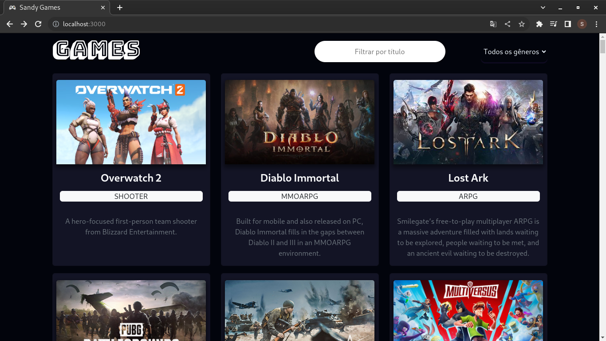
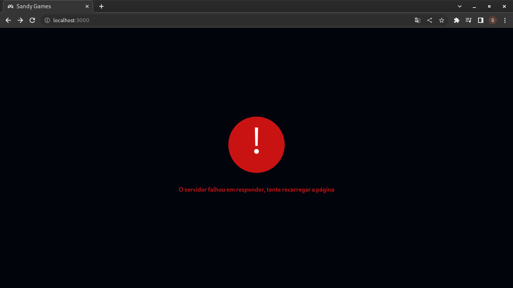

# Projeto Games

Este é um aplicativo baseado em React que apresenta uma coleção de jogos. Ele permite filtrar e pesquisar jogos com base em seus títulos e gêneros.

## Sumário

- [Instalação](#instalação)
- [Recursos](#recursos)
- [Tecnologias Utilizadas](#tecnologias-utilizadas)

## Instalação

Para executar este projeto localmente, siga os seguintes passos:

1. Clone o repositório em sua máquina local.
2. Navegue até o diretório raiz do projeto.
3. Instale as dependências executando o comando: `npm install`.
4. Inicie o servidor de desenvolvimento com o comando: `npm start`.
5. Abra seu navegador da web e visite [http://localhost:3000](http://localhost:3000) para ver o aplicativo em ação.

## Recursos

- **Filtragem:** É possível filtrar os jogos por seus títulos e gêneros. Utilize a barra de pesquisa para filtrar os jogos por título e selecione um gênero na lista suspensa para filtrar por gênero.
- **Carregamento:** O aplicativo exibe uma sobreposição de carregamento enquanto os jogos estão sendo buscados no servidor. Isso fornece aos usuários uma indicação visual de que o conteúdo está sendo carregado.
- **Tratamento de Erros:** Se ocorrer um erro ao buscar os jogos, uma mensagem de erro apropriada é exibida ao usuário. Diferentes cenários de erro, como falha do servidor ou tempo limite, são tratados e exibidos adequadamente.
- **Design Responsivo:** O aplicativo foi projetado para ser responsivo e proporcionar uma experiência de visualização ideal em diferentes dispositivos e tamanhos de tela.

## Tecnologias Utilizadas

- [React](https://reactjs.org/): Framework JavaScript para construção de interfaces de usuário.
- [Bootstrap](https://getbootstrap.com/): Framework CSS para estilização e criação de componentes responsivos.
- [Axios](https://axios-http.com/): Biblioteca JavaScript para realizar requisições HTTP ao servidor.
